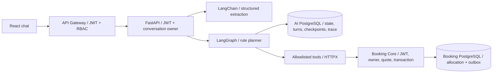

# Trợ lý hội thoại đặt sân

Triển khai theo `Ke_hoach_Chatbot_Conversational_Planning_Execution.md` người dùng cung cấp, tích hợp vào Booking Core hiện có. Điều chỉnh hai điểm so với sơ đồ minh họa: **slot là 60 phút** và tools gọi API của Core thay vì truy cập database sân/booking. Code nằm ở `services/ai-service`; trang chat mới `/booking-assistant` nằm trong Web hiện có. Giao diện booking/Admin gốc vẫn dùng gateway như trước.

## Kiến trúc và công nghệ



| Công nghệ | Dùng ở đâu và lý do |
| --- | --- |
| Python 3.12, FastAPI, Pydantic | Chat API và schema có kiểu; chặn trường dư, giới hạn dữ liệu, chuẩn hóa input trước khi planning. |
| LangChain `ChatOpenAI.with_structured_output` | Adapter endpoint tương thích OpenAI, yêu cầu model trả `ParsedMessage` gồm intent, changes, evidence, confidence. Không dùng đoạn văn tự do làm lệnh đặt sân. |
| LangGraph `StateGraph` | Workflow có node và nhánh rõ ràng; checkpoint PostgreSQL theo conversation/thread; quan sát được bước parse, merge, plan, search, replan, confirm, book. |
| PostgreSQL, SQLAlchemy async, Alembic, psycopg | AI sở hữu database hội thoại riêng; migration có version, lưu trạng thái/turn/trace và dùng advisory lock xuyên các worker. LangGraph dùng bảng checkpoint riêng trong cùng DB AI. |
| HTTPX | Gọi Core với timeout, bearer gốc và request ID; không chuyển cookie/actor headers, không tự retry mutation. |
| React, Vite, TypeScript | Chat có lịch sử, thẻ sân, xác nhận cuối, biên nhận, khôi phục request chưa rõ kết quả; dùng session và theme hiện có. |
| pytest, Vitest, Testcontainers | Kiểm tra policy/hợp đồng/UI và tích hợp Core/PostgreSQL thật trong môi trường test riêng. |
| Python logging JSON, Prometheus | Correlation qua request ID; đo HTTP latency, planner actions, tool outcomes và token usage để ghép monitoring sau. |
| uv + lockfile, Docker Compose, GitHub Actions | Cài dependency tái lập, chạy các deployable/DB riêng và kiểm tra AI trong matrix Python hiện có. |

Tài liệu chính thức: [LangChain structured output](https://docs.langchain.com/oss/python/langchain/structured-output), [ChatOpenAI](https://docs.langchain.com/oss/python/integrations/chat/openai), [LangGraph graph API](https://docs.langchain.com/oss/python/langgraph/graph-api), [LangGraph persistence](https://docs.langchain.com/oss/python/langgraph/persistence), [SQLAlchemy async](https://docs.sqlalchemy.org/en/20/orm/extensions/asyncio.html).

## Lý thuyết áp dụng

**Conversation state và cập nhật DIFF.** Model chỉ đề xuất các trường vừa thêm/sửa/bỏ, kèm evidence nằm trong tin nhắn. Backend merge vào state cũ, giữ trường không đổi. Đổi điều kiện tăng version, xóa options và nonce cũ; không chọn lại bằng ID của lần search đã hết hiệu lực. Model nhận điều kiện hiện tại và lượt nói mới, không cần gửi toàn bộ lịch sử hoặc JWT cho provider.

**Rule-based planning trên state machine.** PARSE → MERGE → PLAN; thiếu/mơ hồ thì hỏi, đủ dữ liệu thì SEARCH → OBSERVE; không có kết quả thì REPLAN. Chọn option dẫn tới bước CONFIRM chờ consent; BOOK chỉ chạy sau đồng ý cuối. Đây là planner v1 trong tài liệu, không phải planner do LLM tự sinh rồi thực thi tùy ý. Mỗi lượt chạy graph từ đầu trên state bền vững; checkpoint giúp lưu/quan sát, còn durable booking intent bảo vệ side effect khi lỗi giữa chừng.

**Constraint satisfaction trên miền rời rạc.** Với thời lượng `d`, cần `d/60` slot khả dụng liên tiếp của **cùng một sân**. `19:00–21:00` là `[1140,1200]`, không ghép một slot sân A với một slot sân B. Ngày, thời lượng, giá tổng và cửa sổ giờ là hard constraints. Giờ ưu tiên/khu vực chỉ được nới khi `soft_fields` cho phép. Lọc tính khả thi trước, rồi xếp theo độ lệch giờ ưu tiên, tổng tiền và thứ tự ổn định; không dùng bộ giải CSP hoặc thuật toán tối ưu mới.

**Human-in-the-loop.** Chọn sân chưa reserve/confirm. Server trả nonce, thời hạn và tóm tắt sân/ngày/giờ/tổng giá. Chỉ nonce hiện tại hoặc câu đồng ý rõ ràng cho lựa chọn đang hiệu lực mới cho phép BOOK; model trả intent `confirm` một mình không cấp quyền. Khi Core báo giá khác dự kiến, bỏ hold cũ và xin consent mới nếu giá còn trong ngân sách.

**Idempotency và phục hồi side effect.** `client_message_id` chống gửi lại một lượt hội thoại; dùng cùng ID cho nội dung khác trả 409. Trước mutation Core, AI commit option/consent/key vào DB của mình. Key Core dẫn xuất ổn định từ conversation + nonce. Nếu mất response trước hoặc sau Core commit, retry tiếp tục đúng reserve/confirm cũ. Chỉ biên nhận `CONFIRMED` của Core mới là thành công. Không có transaction phân tán AI ↔ Core hoặc lời hứa exactly-once cho mọi hệ thống ngoài; invariant allocation và outbox nằm trong transaction của Core.

**Defense in depth.** Gateway, AI và Core đều kiểm tra JWT; gateway kiểm tra role, AI giới hạn owner hội thoại, Core kiểm tra owner/centre và quote. Prompt injection không thay allowlist, token, quyền hoặc điều kiện xác nhận của backend.

## Quy tắc thời gian và giới hạn tìm kiếm

- Múi giờ `Asia/Ho_Chi_Minh`; ngày từ hôm nay tới 90 ngày. “Mai”, “thứ bảy” được hiểu theo thời điểm nhận tin nhắn.
- Duration phải là bội số 60; `90 phút` hoặc giờ ưu tiên `19:30` sẽ hỏi lại, không làm tròn. Biên cửa sổ có thể là `20:30`: đó là giờ **bắt đầu chậm nhất**, nên các slot bắt đầu 19:00/20:00 vẫn có thể chơi 2 tiếng.
- “Khoảng 19:00” cho phép tìm giờ gần đó; giờ chính xác không tự nới kể cả có một cửa sổ rộng hơn. Giá trần là tổng của toàn thời lượng; quote lúc reserve của Core là nguồn quyết định.
- Khu vực được so tên/địa chỉ bỏ dấu. Chưa có tọa độ/GPS nên không tuyên bố khoảng cách km hoặc sân gần nhất thực tế.
- Đọc tối đa 500 trung tâm catalogue, kiểm tra tối đa 5 trung tâm khớp mặc định, trả tối đa 5 options. Giới hạn này có cấu hình tối đa 10; không tuyên bố tìm hết mọi sân khi catalogue lớn.
- Search kiểm tra lịch song song trong giới hạn trên. Tối đa một lần tìm lại ngoài khu vực nếu khu vực là soft; không âm thầm vượt hard budget/date/duration/window. Conflict lúc đặt trả `SLOT_UNAVAILABLE`, yêu cầu người dùng tìm/chọn lại.
- Một lượt có deadline 40 giây; model timeout mặc định 25 giây, Core 5 giây/call; gateway 45 giây, client 65 giây. Request timeout giữ key để phục hồi, không tự báo đặt thành công.

## API và tools

Mọi endpoint sau cần business bearer JWT. Gateway chuyển các route conversation tới AI với cùng path; route booking chatbot được tách để không đụng API booking gốc.

| Gateway | AI | Hành vi |
| --- | --- | --- |
| POST `/api/conversations` | cùng path | Tạo hội thoại của signed `sub`. |
| GET `/api/conversations/:id` | cùng path | State, 200 lượt gần nhất, request chưa trả lời để replay với cùng key. |
| POST `/api/conversations/:id/messages` | cùng path | Tin nhắn hoặc action select/confirm/retry; response có options, next action, nonce, booking và plan version. |
| GET `/api/conversations/:id/trace` | cùng path | Các bước xử lý đã lưu; chỉ owner. |
| GET `/api/ai/bookings/:id` | GET `/api/bookings/:id` | Đọc biên nhận qua Core; chatbot chỉ cho đọc booking của chính actor. |

`search_availability` là LangChain StructuredTool, nhận constraints có schema, lấy catalogue/availability qua HTTP. `get_option_details` chỉ đọc option server đã lưu. `create_booking` là orchestration reserve/confirm/recovery có policy trong BOOK. `get_booking` chỉ gọi Core; không có SQL tool, payment/pass hoặc admin mutation trong allowlist.

AI không được cấp database URL Booking Core trong runtime. Các biến `AI_LIVE_*` chỉ phục vụ integration test với DB tên kết thúc `_test`; fixture tạo/xóa dữ liệu của chính nó. Database AI lưu transcript và checkpoint, không lưu JWT/API key. Trace gồm node/outcome/version, không phải chain-of-thought riêng của model.

## Chạy và chọn provider

Từ root repo, chạy toàn stack demo offline:

```bash
docker compose up --build -d
docker compose logs -f ai gateway api
```

Web: `http://localhost:8082/booking-assistant`. AI: `localhost:8000`; DB AI: `localhost:5433`; các cổng Core/gateway/Admin giữ như README. Khi không có `.env` root, Compose fallback `AI_PROVIDER=fake`, `AI_OFFLINE=true`; UI ghi rõ chưa dùng LLM. File `.env.example` root và AI hiện chọn Groq; `.env` local riêng có key sẽ chạy provider thật. Muốn demo offline, đặt rõ `AI_PROVIDER=fake`, `AI_OFFLINE=true`.

Để dùng Groq, copy `.env.example` root thành `.env` được gitignore và điền key riêng:

```dotenv
AI_PROVIDER=openai-compatible
AI_OFFLINE=false
LLM_BASE_URL=https://api.groq.com/openai/v1
LLM_MODEL=openai/gpt-oss-120b
LLM_API_KEY=<private-key>
```

Sau đó `docker compose up -d --build ai-migrate ai gateway`. `openai-compatible` là tên protocol, không có nghĩa request gửi tới OpenAI: endpoint ở trên gọi Groq. Adapter hiện có dùng được theo [Groq OpenAI compatibility](https://console.groq.com/docs/openai), không cần thêm SDK riêng. Model có thể đổi; endpoint/model phải hỗ trợ function calling + structured schema. Với OpenAI, đổi base URL/model/key tương ứng. Với Ollama trên host: `LLM_BASE_URL=http://host.docker.internal:11434/v1`, `LLM_API_KEY=ollama-local`, `LLM_MODEL=<model đã cài hỗ trợ tools>`; server cần lắng nghe địa chỉ mà container truy cập được. Chưa chứng minh mọi model Ollama đều tương thích. Không đưa key vào `VITE_*` hoặc frontend bundle.

Chạy AI bằng Python local sau khi Core và hai database đã sẵn sàng:

```bash
cd services/ai-service
cp .env.example .env
# Điền LLM key, hoặc chọn AI_PROVIDER=fake và AI_OFFLINE=true để demo.
uv sync --locked --all-groups
uv run alembic upgrade head
uv run python -m app.migrate
uv run uvicorn app.main:app --host 127.0.0.1 --port 8000 --no-access-log
```

Migration conversation bằng Alembic và migration checkpoint qua `AsyncPostgresSaver.setup` chạy riêng trước runtime. Secret/issuer/audience của gateway, AI và Core phải khớp. Dockerfile mặc định production chặn fake provider và secret development; Compose override môi trường development để demo. Host/Identity phải cấp session theo [LEGACY_UI.md](LEGACY_UI.md); không thêm màn hình đăng nhập. Production cần secret riêng, TLS/ingress, cấu hình provider và backup/access/retention cho transcript.

## Kiểm tra và đánh giá

```bash
cd services/ai-service
uv sync --locked --all-groups
uv run ruff check app tests evaluation alembic
uv run mypy app
uv run pytest tests -q
AI_PROVIDER=fake AI_OFFLINE=true GOLDEN_SUITE=small uv run python -m evaluation.evaluate
AI_PROVIDER=fake AI_OFFLINE=true GOLDEN_SUITE=full uv run python -m evaluation.evaluate
```

Live integration mặc định cần Docker: khởi tạo PostgreSQL riêng và build/chạy Core thật. Nếu Docker không khả dụng, ba test live được skip và phải báo rõ; có thể cung cấp cả `AI_LIVE_CORE_URL`, `AI_LIVE_CORE_DATABASE_URL`, `AI_LIVE_DATABASE_URL` của Core/DB test do mình sở hữu để chạy không Docker. Không trỏ vào database ứng dụng.

Golden small có 30 mẫu, full 40 mẫu, clock cố định để đánh giá ngày tương đối; metrics được tính từ expected/actual, không hard-code. Schema validity, field/value F1, accuracy ngày/thời lượng/ngân sách và intent accuracy nằm trong `reports/golden.json`. CI fake gate bảo vệ regression parser/policy, **không phải độ chính xác LLM thật hoặc task success rate**. Đánh giá provider thật là opt-in với cấu hình/key riêng; cần chạy trước khi kết luận model dùng tốt tiếng Việt. Multi-turn, consent, concurrency, recovery và booking commit được kiểm tra riêng trong integration/UI tests.

Các kiểm tra tương ứng nhóm kịch bản của kế hoạch: đầy đủ/thiếu thông tin; sửa ngày/giờ/giá nhưng giữ ngữ cảnh; xóa khu vực; chọn option; hard budget; soft time; không có sân; race lúc confirm; trả biên nhận; checkpoint sau tạo instance mới; mất response sau commit và dừng worker sau commit consent; advisory lock giữa hai connection pool độc lập. Các câu nói tự nhiên ngoài corpus cần đánh giá với model thật, không được suy ra từ FakeParser.

## Auth và monitoring

Gateway dùng **JWT Bearer HS256 stateless**: kiểm tra chữ ký `JWT_SECRET`, `iss`, `aud`, `exp`, signed `sub`/`role`; `loyaltyPoints` phải là số nguyên không âm. `authenticate` cho request không token đi tiếp để route public hoạt động; `authorize` tại route protected trả 401 nếu thiếu actor, 403 nếu role không được phép. Roles hiện có: `user`, `center_manager`, `super_admin`.

Phân quyền tài nguyên vẫn ở Core: user chỉ booking của mình, manager chỉ centre được quản lý, admin theo policy Core. Client không thể sửa `X-User-ID`/`X-User-Role` để tự cấp quyền. Catalogue/availability public; đặt/hủy/history/quản lý được bảo vệ. AI xác minh JWT lại và chỉ owner được đọc/ghi hội thoại, kể cả token admin cũng không đọc chat người khác. Không có Identity/login/refresh/revocation trong gateway; JWT hợp lệ còn hạn là nguồn danh tính hiện tại. [API_GATEWAY.md](API_GATEWAY.md) mô tả routes và cấu hình.

`/metrics` cần bearer monitoring riêng, không dùng business JWT. AI readiness kiểm tra DB, checkpoint và Core, liveness kiểm tra tiến trình; không gọi model mất phí ở health check. Metrics: `ai_http_requests_total`, `ai_http_duration_seconds`, `ai_agent_actions_total`, `ai_tool_calls_total`, `ai_llm_tokens_total`. Labels hữu hạn, không chứa user/conversation/booking ID. Logs stdout có service/event/requestId/node/outcome hoặc method/route/status/durationMs; không log body, transcript, key hoặc Authorization. HTTP request ID đi Web → gateway → AI → Core. Xem [MONITORING.md](MONITORING.md) để scrape và xử lý sự cố.
