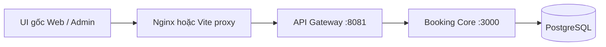

# API Gateway cho Booking Core

Nguồn [Badminton_manager_microservices tại 484d381e](https://github.com/chiendz11/Badminton_manager_microservices/tree/484d381e873f513ed4faa4413407502112f4885d). Lấy hợp đồng/router Booking Core từ `BM/api_gateway`, port sang TypeScript/Express 5 và thay proxy service cũ bằng adapter Core. Đây là bản thích nghi có thay đổi implementation, không phải bản copy byte-for-byte gateway đầy đủ.

| Nguồn cũ                                                               | File/phần mới                                                       | Thay đổi                                                                 |
| ---------------------------------------------------------------------- | ------------------------------------------------------------------- | ------------------------------------------------------------------------ |
| `BM/api_gateway/src/routes/booking.route.js`                           | `services/api-gateway/src/routes/booking.route.ts`, modules/booking | Giữ các đường dẫn booking, bỏ pass/payment; Core v1 thay booking_service |
| `BM/api_gateway/src/routes/user.route.js`                              | booking routes cho history/statistics/exists-pending                | Chỉ lấy read model booking cá nhân; không lấy user CRUD/auth             |
| `BM/api_gateway/src/middleware/{authenticate,authorize}.middleware.js` | middleware TypeScript cùng tên                                      | Xác minh JWT tại gateway và Core; không tin actor headers                |
| `BM/api_gateway/src/{graphql.setup.js,configs/env.config.js}`          | graphql.setup.ts, configs/environment.ts                            | Bỏ federation/subgraph URL, dùng duy nhất BOOKING_CORE_URL               |
| `BM/services/center_service/src/graphql/schema.js`                     | modules/centers/center.schema.ts                                    | Giữ SDL trung tâm gốc, chỉ bỏ federation directives/extend               |

Gateway không đọc DB hoặc gọi service cũ. Giá, quyền owner/centre, lock slot, idempotency, snapshot giá và outbox vẫn tại Core. ID dùng UUID của Core; không tự map MongoDB ObjectId cũ. Đây là repo mới với seed mới, không migrate dữ liệu nguồn cũ.

## Routes được giữ

| Gateway                                      | Core / hành vi                                                                                                                      |
| -------------------------------------------- | ----------------------------------------------------------------------------------------------------------------------------------- |
| POST /graphql                                | centers/center/createCenter/updateCenter/deleteCenter → Core centre REST; mutation cần manager/admin; tạo/phân công cần super_admin |
| GET /api/booking/pending/mapping             | Availability phút → 19 slot giờ 05–24; public, không lộ tên/userId khách                                                            |
| POST /api/booking/pending/pendingBookingToDB | Reserve rồi confirm trực tiếp; trả envelope booking confirmed, không payment                                                        |
| GET /api/booking/bookings                    | Danh sách quản lý, server giới hạn theo centre sở hữu                                                                               |
| POST /api/booking/check-available-courts     | Preview toàn bộ occurrence trong 31 ngày, nhóm thứ/sân trống                                                                        |
| POST /api/booking/create-fixed-bookings      | Gom từng ngày/sân thành occurrences; Core tạo toàn chuỗi atomic, có idempotency                                                     |
| PATCH /api/booking/:bookingId                | Chỉ status cancelled → Core cancel; chưa bắt đầu                                                                                    |
| DELETE /api/booking/:bookingId               | Owner ẩn history sau khi hủy/kết thúc; không hard delete                                                                            |
| GET /api/booking/:id/status                  | Status sau owner/manager check                                                                                                      |
| GET /api/user/:userId/booking-history        | Chỉ signed sub đúng userId, filter/pagination tại Core                                                                              |
| GET /api/user/me/statistics                  | Thống kê trên Core read model; pointsChange 0 vì chưa có Identity awards                                                            |
| GET /api/user/me/exists-pending-booking      | Chỉ hold còn hạn của actor, không lộ hold người khác                                                                                |

Legacy status paid được nhận ở filter và chuyển sang CONFIRMED; response dùng confirmed, không tuyên bố đã trả tiền. Pending/failed booking filters trả danh sách rỗng vì Core chỉ lưu booking CONFIRMED/CANCELLED, hold nằm ở Reservation. Centre delete là deactivate, từ chối nếu còn allocation tương lai. Thay số sân/bảng giá/centre fields atomic; sân đóng vẫn giữ trong DB phục vụ lịch sử. Media file IDs là metadata; Storage URL/upload và rating aggregates chưa nối.

## Cấu hình và session

Compose mặc định tự nối toàn luồng; không cần gateway cũ. Node local: copy `services/api-gateway/.env.example` thành `.env`, chạy `pnpm dev:gateway`. `BOOKING_CORE_URL` là HTTP origin không credentials/path/query. JWT_SECRET (>=32), JWT_ISSUER, JWT_AUDIENCE phải khớp Core/Identity; JWT HS256 cần exp và sub/role hợp lệ. UserName/price/userId do browser gửi không thay actor/quote trong daily booking. Fixed booking cho người khác cần manager có quyền centre; directory do host cấp theo [LEGACY_UI.md](LEGACY_UI.md).

API_GATEWAY_URL của Nginx mặc định http://gateway:8081; DEV_API_GATEWAY_URL của Vite mặc định http://localhost:8081. Chạy production với secret riêng, NODE_ENV=production, monitoring token riêng, CORS origins cụ thể và TLS ở ingress. Không commit JWT thật vào source/env build. Gateway không triển khai đăng nhập/refresh/logout hoặc dev session; có thể dùng công cụ CLI demo của Core để kiểm tra local bên ngoài UI.

Client mới luôn gửi Idempotency-Key ổn định khi retry daily/fixed. Gateway giữ compatibility khi client cũ không gửi key bằng UUID mới, nên không bảo đảm dedup giữa những request thiếu key. Không retry tự động upstream mutation. Nếu mất response giữa reserve/confirm, retry cùng key tiếp tục hold/confirm idempotent; nếu hold đã hết hạn trả 410 và phải chọn lại với key mới. Timeout mặc định 5 giây mỗi upstream call, cấu hình UPSTREAM_TIMEOUT_MS 100–30000. Không có transaction phân tán qua hai HTTP call; Core sở hữu từng transaction và thời hạn hold.

GraphQL giới hạn body 256KB, query 40KB, depth 12, số node mở rộng fragment 400; chặn fragment cycle và nhiều mutation trong một request. Metrics dùng monitoring bearer riêng, không business JWT; JSON logs có requestId xuyên gateway/Core. Không forward client actor/cookie/host headers. Routes ngoài phạm vi trả 404: auth, pass/payment, news/rating, inventory/transactions, social/notification/users/storage; UI các miền đó vẫn giữ, backend sẽ ghép sau.

Contracts tại contracts/gateway; gateway unit/contract và integration Core/Postgres thực tại services/api-gateway/test. Xem [VALIDATION.md](VALIDATION.md) cho kiểm chứng local.
