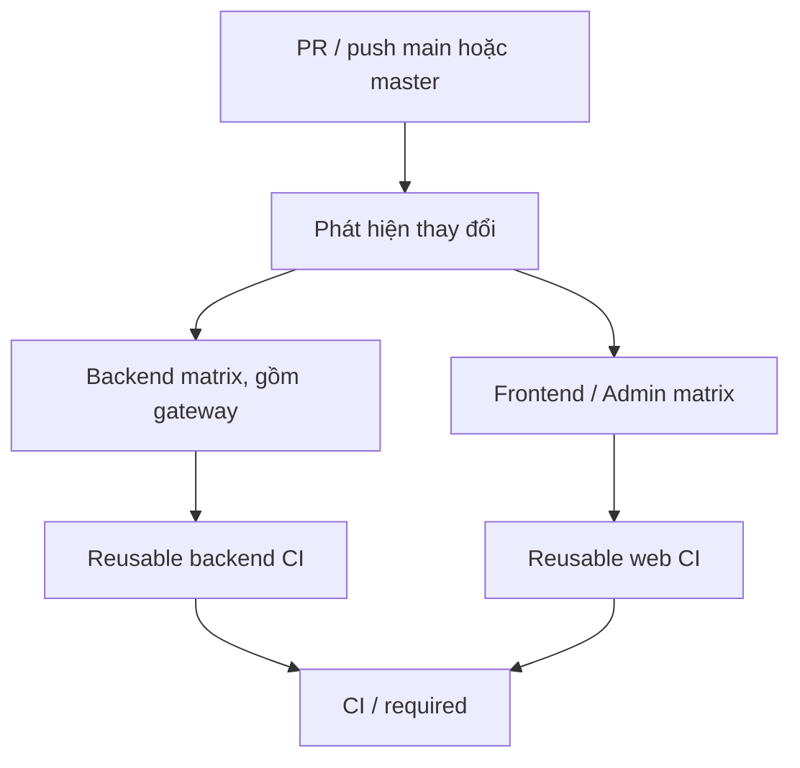

# Thiết kế CI

## Phạm vi

| Nhóm | Component |
| --- | --- |
| Gateway | `BM/api_gateway` |
| NestJS / TypeScript | `booking_service`, `notification_service`, `social_service` |
| Express / JavaScript | `auth_service`, `center_service`, `inventory_service`, `new_service`, `rating_service`, `storage_service`, `transaction_service`, `user_service` |
| React / Vite | `Frontend`, `Admin` |

Các service nằm trong `BM/services/`. Giữ tên thư mục thực tế `new_service` dù đây là news service. `ai_service` bị loại khỏi discovery và matrix, kể cả khi workflow hoặc cấu hình chung thay đổi. Service Node mới có `package.json` được tự nhận diện; cần lockfile, Dockerfile và CI contract trước khi chạy.

## Luồng chạy



- PR so sánh base SHA với commit đang checkout; push dùng `before` với commit hiện tại. Fetch đủ lịch sử để so sánh commit.
- Push đầu tiên hoặc `workflow_dispatch`: chọn tất cả component trong phạm vi.
- Thay đổi `.github/**` và cấu hình dependency chung ở root: chạy toàn bộ component trong phạm vi.
- Thay đổi file chung trực tiếp trong `BM/`, `BM/shared/**`, `BM/contracts/**`, `BM/nginx/**`: chạy mọi backend trong phạm vi.
- Chỉ sửa tài liệu hoặc AI: không chạy application job. Xóa toàn bộ service không tạo job trỏ tới thư mục đã mất.
- Check `CI / required` thất bại khi discovery hoặc job được chọn thất bại/hủy. Matrix rỗng được kiểm tra là `skipped`.
- Một lượt mới hủy lượt cũ cùng PR/nhánh. Backend chạy tối đa 4 component cùng lúc.

## CI contract cần chuẩn hóa trong repo ứng dụng

Backend bắt buộc:

```text
lint                 # chỉ kiểm tra; không --fix
test:unit            # chạy một lượt và thoát, không watch
test:integration     # service tự chuẩn bị/dọn dependency của mình
```

Backend tùy chọn:

```text
prisma:generate      # auth_service có Prisma
build                # NestJS bắt buộc theo ứng dụng; JS thuần có thể không cần
```

Frontend/Admin bắt buộc: `lint`, `test:unit`, `build`. Script `build` của Vite phải tạo `dist/`.

CI không dùng `--if-present` cho test, không dùng `--passWithNoTests`, không chấp nhận `Error: no test specified`, không tự sửa source. Thiếu script sẽ báo lỗi có hướng dẫn. Nhánh cấu hình này không sửa `package.json`, Dockerfile hay test ứng dụng.

Ví dụ script NestJS cần thêm/chỉnh tại repo ứng dụng:

```json
{
  "lint": "eslint \"{src,test}/**/*.ts\"",
  "lint:fix": "eslint \"{src,test}/**/*.ts\" --fix",
  "test:unit": "jest --runInBand",
  "test:integration": "jest --config ./test/jest-integration.json --runInBand",
  "build": "nest build"
}
```

`jest-integration.json` là cấu hình cần được đội phát triển triển khai kèm test thật; workflow không giả định file này đã tồn tại. Với Jest ESM của auth, giữ runner `node --experimental-vm-modules` và tách riêng `tests/unit` / `tests/integration` khi bổ sung script. Không alias `test:integration` vào scaffold e2e chưa hoạt động.

## Những điểm chưa sẵn sàng trong code nền đã tham khảo

- Nhiều Express service và gateway còn script test mẫu, chưa có lint/unit/integration contract.
- NestJS có lint đi kèm `--fix`; cần tách `lint` và `lint:fix`.
- Auth có test và Prisma nhưng cần script unit/integration độc lập và database kiểm thử cô lập.
- Frontend/Admin dùng Vite nhưng chưa có lint/test contract hoàn chỉnh.
- Notification có `pnpm-lock.yaml`; một số service có cả npm và pnpm lockfile.

Những điểm này được ghi nhận để áp dụng CI sau; **không được sửa hoặc chạy test ứng dụng trong nhánh này**.

## Dependency và Docker

Runner dùng Ubuntu, Node.js 22. Package manager được chọn từ `packageManager` trong `package.json`; nếu không khai báo, ưu tiên `package-lock.json`, sau đó `pnpm-lock.yaml`. npm dùng `npm ci`; pnpm dùng phiên bản major 10 và `pnpm install --frozen-lockfile`. Nếu ứng dụng dùng pnpm major khác, chỉnh input `version` tương ứng trước khi áp dụng. Cache dựa trên lockfile của từng component.

Dockerfile được nhận diện cả `Dockerfile` và `dockerfile` (social hiện dùng chữ thường). Chạy `docker build` trong thư mục service và chỉ kiểm tra build, không push image hay deploy. Build Docker có thể dùng package manager khác với bước test nếu Dockerfile cũ cấu hình như vậy; nên thống nhất một lockfile trong repo ứng dụng sau.

## Service integration và các bước tiếp theo

Service tự khởi tạo Testcontainers cho đúng MongoDB, PostgreSQL, Redis hoặc RabbitMQ cần dùng, và luôn dọn tài nguyên trong teardown. GitHub hosted runner cung cấp Docker; reusable workflow không tạo hàng loạt database cho tất cả service. Test không được phụ thuộc database thật hoặc secret production. Nhánh này chỉ cung cấp bước gọi `test:integration`, không cung cấp hay chạy các test đó.

Cross-service integration (ví dụ booking phát event rồi notification xử lý) sẽ có `integration.yml` riêng sau khi các test đó tồn tại. Release ECR/GitOps là workflow riêng ở giai đoạn sau; chưa tạo skeleton có khả năng deploy hoặc yêu cầu AWS credentials.

## Áp dụng

1. Đưa thư mục `.github` từ nhánh này vào repo ứng dụng có cấu trúc thư mục nêu trên.
2. Chuẩn hóa package scripts, lockfile, Dockerfile và các test thật theo contract.
3. Chỉnh branch trigger nếu nhánh chính không phải `main`/`master`.
4. Tạo PR vào nhánh chính. Có thể dùng `workflow_dispatch` để chạy toàn bộ component ngoài AI.
5. Sau khi CI hoạt động, cấu hình branch protection với check `CI / required` nếu cần.

Push nhánh `ci/bootstrap` của repo cấu hình không chạy application CI. Không có action nào tự tải source của repo gốc. Kiểm tra cú pháp YAML/script của bộ cấu hình không thay thế cho kiểm thử ứng dụng.
